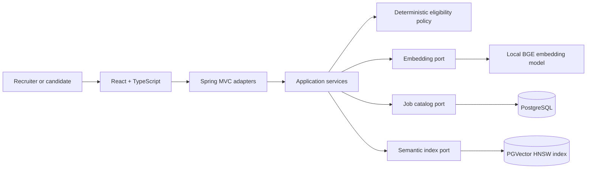
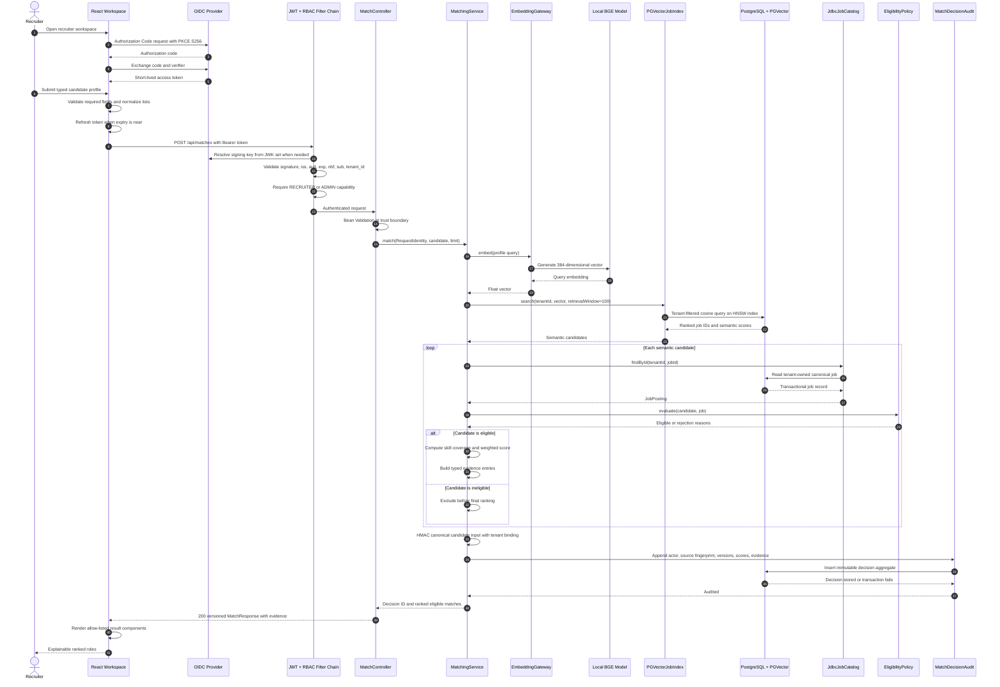

# Talent Intelligence Platform

[](https://github.com/pedrovvitor/talent-intelligence-platform/actions/workflows/ci.yml)
[](CHANGELOG.md)
[](LICENSE)

An explainable candidate-to-job decision pipeline built with Kotlin, Spring Boot, LangChain4j, React, PostgreSQL, and PGVector. It combines semantic retrieval with deterministic business policies so that AI improves discovery without controlling eligibility or inventing evidence.

This is not a free-form chat. The model creates retrieval representations; typed application services evaluate real catalog data, enforce salary, location, seniority, and work-mode rules, and return recruiter-verifiable evidence.

## Why it matters

Keyword filters miss transferable experience, while opaque AI rankings create legal, operational, and trust risks. Talent Intelligence Platform demonstrates a safer pattern:

- semantic retrieval expands discovery beyond exact keywords;
- deterministic policies remain authoritative for hard constraints;
- every score is decomposed into evidence a user can inspect;
- PostgreSQL remains the transactional source of truth;
- local embeddings keep the first release reproducible and free of external model credentials.

## Current release

`v0.1.1` delivers a production-shaped vertical slice:

- job catalog write and read APIs;
- local BGE-small-en-v1.5 embeddings through LangChain4j;
- PGVector cosine search with an HNSW index;
- eligibility filtering before final ranking;
- weighted semantic relevance and explicit skill coverage;
- typed React workspace with loading, empty, success, and error states;
- Flyway migrations, health probes, graceful shutdown, validation, and stable API errors;
- non-root, read-only application containers in Docker Compose;
- unit tests plus a Docker-backed PGVector migration test.

Authentication, immutable decision audit, OpenTelemetry, Redis semantic cache, agent tool calling, SSE Generative UI, and Kubernetes delivery are deliberately tracked as future releases. See [production readiness](docs/operations/production-readiness.md).

## Architecture



The code follows ports and adapters inside a modular monolith. Domain policy has no dependency on Spring, HTTP, persistence, or model providers.

### Match request sequence



More detail is available in [architecture](docs/architecture/architecture.md) and the [decision records](docs/adr/).

## Run locally

Prerequisite: Docker Desktop with Compose v2.

```bash
git clone https://github.com/pedrovvitor/talent-intelligence-platform.git
cd talent-intelligence-platform
docker compose up --build
```

Open `http://localhost:3000`. The first build downloads container and Gradle/npm dependencies; subsequent starts are faster. No API key is required.

Sign in with a synthetic local account:

| Capability | Username | Password |
|---|---|---|
| Recruiter | `recruiter.synthetic` | `recruiter-local-only` |
| Admin | `admin.synthetic` | `admin-local-only` |

Keycloak is available at `http://localhost:8180`. Its development mode, local users, and bootstrap credentials are intentionally excluded from the production design.

Health endpoints:

```text
http://localhost:8080/actuator/health/liveness
http://localhost:8080/actuator/health/readiness
```

Stop the application without deleting local data:

```bash
docker compose down
```

## API example

```bash
curl --request POST http://localhost:8080/api/matches \
  --header "Authorization: Bearer $ACCESS_TOKEN" \
  --header "Content-Type: application/json" \
  --data '{
    "headline": "Senior JVM Engineer",
    "summary": "Backend engineer building reliable Kotlin and Java services",
    "skills": ["Kotlin", "Java", "Spring Boot", "PostgreSQL"],
    "seniority": "SENIOR",
    "preferredWorkModes": ["REMOTE", "HYBRID"],
    "preferredLocations": ["Fortaleza"],
    "minimumSalary": 110000,
    "limit": 5
  }'
```

`ACCESS_TOKEN` is a short-lived token issued for the API audience. The browser obtains it through Authorization Code with PKCE; the local-only `talent-intelligence-smoke` client supports deterministic command-line verification. See [authentication and authorization](docs/security/authentication-and-authorization.md).

## Engineering evidence

| Concern | Implementation |
|---|---|
| AI boundary | Embedding behind an application port; no repository or unrestricted tool access |
| Hallucination control | Scores derive only from stored jobs and deterministic calculations |
| Explainability | Typed semantic, skill, and eligibility evidence in every result |
| Decision governance | Append-only actor/source/version audit with reproducible score and evidence snapshots |
| Architecture | Domain, application, and adapters with dependency inversion |
| Data integrity | Flyway-managed PostgreSQL schema; canonical records separated from vectors |
| Tenant isolation | Signed claim, typed context, scoped catalog/vector queries, and composite database constraints |
| Retrieval | Version-ready 384-dimensional vectors and HNSW cosine index |
| Resilience | Bounded DB pool, explicit connection timeouts, probes, graceful shutdown |
| Supply chain | Locked npm graph, pinned major toolchain versions, automated dependency updates |
| Runtime security | Input validation, security headers, non-root containers, read-only filesystems |
| Quality | Strict Kotlin warnings, strict TypeScript, ESLint, unit and integration tests |

## Development

Backend requires JDK 21:

```bash
./gradlew test
./gradlew build
```

Frontend requires Node.js 24:

```bash
npm ci --prefix frontend
npm run lint --prefix frontend
npm run typecheck --prefix frontend
npm run test --prefix frontend
npm run build --prefix frontend
```

Read [CONTRIBUTING.md](CONTRIBUTING.md) and the repository-wide [agent contract](AGENTS.md) before changing code.

## Delivery roadmap

- `v0.2.0`: OIDC/RBAC, tenant isolation, immutable match-decision audit, model and policy version capture.
- `v0.3.0`: bounded agent tools, approval gates, SSE event contract, and allow-listed Generative UI.
- `v0.4.0`: Redis semantic cache, OpenTelemetry, SLO dashboards, load tests, and token/cost telemetry.
- `v1.0.0`: Kubernetes/GitOps deployment, WAF/API gateway integration, backup restore drill, and production threat-model closure.

The executable backlog is in [docs/product/backlog.md](docs/product/backlog.md).

## Documentation

- [Product specification](docs/product/product-spec.md)
- [Architecture](docs/architecture/architecture.md)
- [Match decision audit](docs/architecture/decision-audit.md)
- [Dependency policy](docs/architecture/dependency-policy.md)
- [Coding standards](docs/engineering/coding-standards.md)
- [Security model](docs/security/security-model.md)
- [Authentication and authorization](docs/security/authentication-and-authorization.md)
- [Tenant isolation](docs/security/tenant-isolation.md)
- [Data governance](docs/security/data-governance.md)
- [Production readiness](docs/operations/production-readiness.md)
- [Architecture decision records](docs/adr/)

## License

Licensed under the [MIT License](LICENSE).
