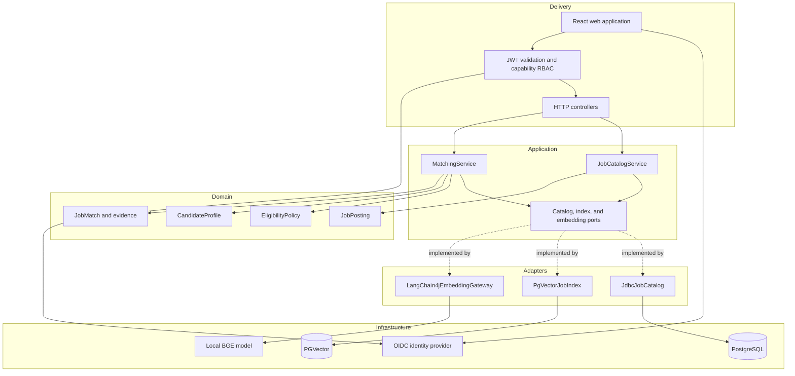

# Architecture

## Style

The initial system is a modular monolith using ports and adapters. This keeps business decisions testable without distributing a small workload across premature services. Boundaries can later become deployment seams when independent scaling, ownership, or failure isolation justifies it.

## Dependency rules

- Domain types depend only on the Kotlin and Java standard libraries.
- Application services depend on domain types and application ports.
- Adapters depend inward and own all Spring, HTTP, SQL, and model-provider details.
- Controllers translate transport payloads; they do not contain business policy.
- PostgreSQL is canonical. Vector rows are derived representations and may be rebuilt.

## Data model

- `tenants` is the ownership root established by the signed identity contract.
- `jobs` stores canonical structured job postings scoped by non-null tenant identity.
- `job_embeddings` stores a 384-dimensional vector keyed one-to-one to a job within its tenant.
- A composite tenant/job foreign key prevents cross-tenant or orphaned embeddings.
- HNSW with cosine operators accelerates nearest-neighbor retrieval.

Every repository and semantic-index operation takes an explicit `TenantId`. Future cache keys must contain tenant, model, policy, and normalized-input identity. See [tenant isolation](../security/tenant-isolation.md).

## AI boundary

Version 0.1 uses an in-process embedding model, not a generative model. This is intentional: retrieval is probabilistic, but authorization and eligibility remain deterministic.

Future agent tools must call application use cases through narrow typed contracts. They may not receive repositories, database connections, arbitrary URLs, shell access, or generic SQL tools. State-changing tools require identity, authorization, idempotency, audit, and an explicit approval policy.

## Scaling path

1. Scale stateless API replicas behind an L7 gateway.
2. Move job embedding generation to an idempotent outbox consumer when write latency or volume requires it.
3. Add a tenant-safe Redis cache for repeated semantic queries.
4. Separate ingestion only when its scaling and failure profile diverges materially from interactive matching.

## Failure behavior

- Invalid requests fail at the HTTP boundary with stable error codes.
- Missing canonical jobs are ignored rather than producing vector-only results.
- Ineligible jobs are removed regardless of semantic relevance.
- A database or embedding failure propagates as an error; the system does not fabricate matches.
- Graceful shutdown allows in-flight requests to finish within a bounded phase.
