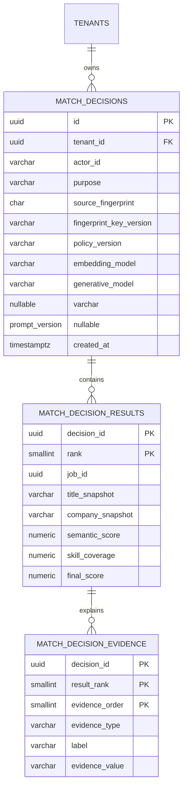
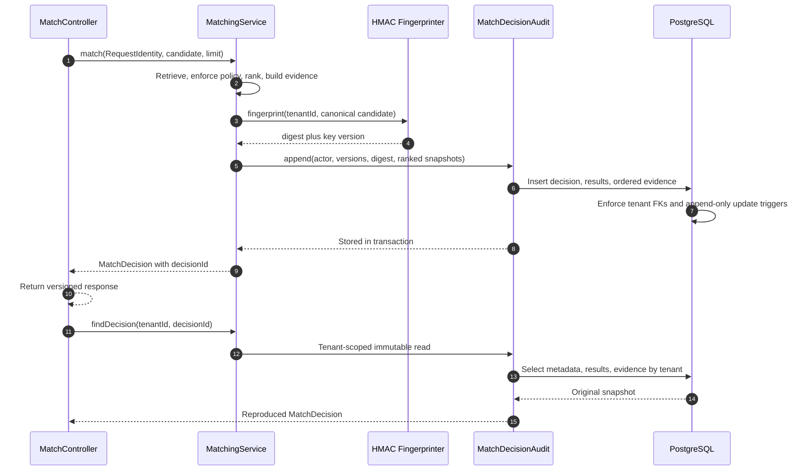

# Match Decision Audit

## Audit aggregate

The audit aggregate is separate from mutable catalog records. Job identifiers retain lineage, while title and company snapshots preserve what the recruiter saw. Scores and evidence are normalized rather than serialized into an opaque document.

## Write and reproduction flow

## Version contract

| Field | v0.2 value | Rule |
|---|---|---|
| Policy | `eligibility-policy-v1` | Change whenever eligibility behavior changes |
| Embedding model | `bge-small-en-v1.5-q` | Supplied by the embedding adapter and used for vector lookup |
| Generative model | `null` | Required when a generative model influences the decision |
| Prompt version | `null` | Required when a prompt influences the decision |
| Fingerprint key | `local-v1` locally | Identifier only; production key material belongs in a secrets manager |

The API never accepts these versions from the browser. They originate from trusted backend components.
