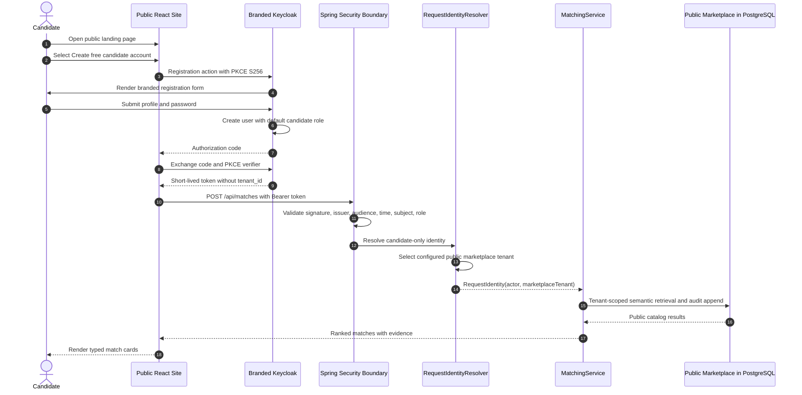
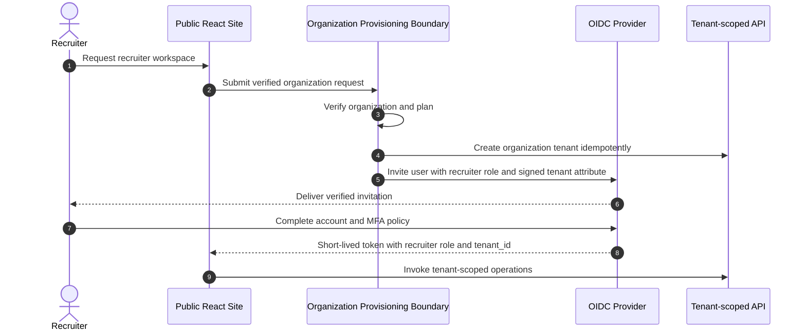

# Onboarding and Access

## Account types

Candidate accounts are self-service. They receive the least-privilege `candidate` role and operate only against the public marketplace tenant selected by the API.

Recruiter and administrator accounts are organization-managed. A recruiter workspace owns jobs, embeddings, and audit records, so the organization provisioning flow must create the tenant and issue roles through an administrative boundary. A public registration form must never let a user select `recruiter`, `admin`, or `tenant_id`.

## Candidate registration sequence

## Recruiter onboarding sequence

Organization provisioning is documented but not implemented in version 0.3. The local environment provides a synthetic recruiter to make the implemented authorization path reproducible.

## Local demo identities

| Persona | Username | Password | Scope |
|---|---|---|---|
| Candidate | `candidate.synthetic` | `candidate-local-only` | Public jobs and new match decisions |
| Recruiter | `recruiter.synthetic` | `recruiter-local-only` | Demo-tenant jobs and audited matching |
| Administrator | `admin.synthetic` | `admin-local-only` | Demo-tenant catalog administration |

These credentials are local-only and contain no personal data.
