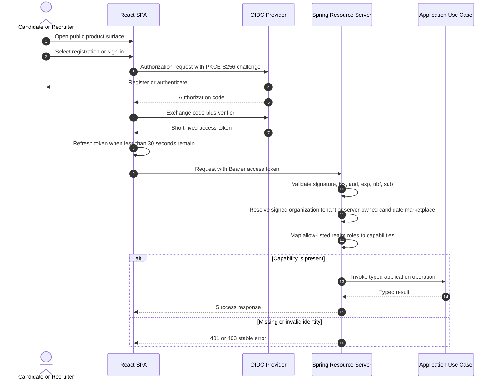

# Authentication and Authorization

## Security boundary

The React application is an OIDC public client. It uses Authorization Code with PKCE and never stores a client secret. Anonymous visitors see the product surface first; the adapter initializes for an explicit sign-in/registration action and for the authorization callback. The API is an OAuth2 Resource Server and accepts only signed JWT access tokens that satisfy every validation rule below.

| Claim or property | Required value | Enforcement |
|---|---|---|
| Signature algorithm | Trusted asymmetric key published by the configured JWK set | Spring Security JWT decoder |
| `iss` | Exact configured issuer | Spring Security issuer validator |
| `aud` | Contains `talent-intelligence-api` | Spring Boot audience validator |
| `exp` and `nbf` | Token is currently valid | Spring Security timestamp validator |
| `sub` | Non-empty stable actor identifier | JWT authentication converter |
| `tenant_id` | UUID for recruiter/admin organization access; absent for candidate-only access | JWT converter and explicit request identity |
| `realm_access.roles` | `candidate`, `recruiter`, or `admin` | Explicit allow-list; all other roles are ignored |

Candidate-only tokens are the single narrow exception to the signed tenant claim requirement. The API maps them to a configured public marketplace tenant. A token that includes recruiter or administrator capability still fails closed without a valid signed tenant UUID.

The JWK endpoint may use an internal service address while `iss` retains the browser-visible issuer. This avoids coupling API startup to OIDC discovery and preserves exact issuer validation.

## Capability matrix

| Endpoint | Anonymous | Candidate | Recruiter | Admin |
|---|---:|---:|---:|---:|
| `GET /actuator/health/**` | Allow | Allow | Allow | Allow |
| `GET /api/jobs` | Deny | Public marketplace | Tenant | Tenant |
| `POST /api/matches` | Deny | Public marketplace | Tenant | Tenant |
| `GET /api/matches/{id}` | Deny | Deny | Tenant | Tenant |
| `POST /api/jobs` | Deny | Deny | Deny | Allow |
| Other `/actuator/**` | Deny | Deny | Deny | Allow |
| Every unspecified route | Deny | Deny | Deny | Deny |

Authentication failures return `401 AUTHENTICATION_REQUIRED`. Authenticated principals without the required capability receive `403 ACCESS_DENIED`. Authorization runs before request parsing and business policy.

## Browser flow

## Local identity provider

Docker Compose runs Keycloak `26.7.2` in development mode and imports `infra/keycloak/talent-intelligence-realm.json`. Development mode, bootstrap credentials, the H2 identity store, and the direct-grant smoke client are local-only controls and must not be promoted to production.

The versioned realm definition contains synthetic users only:

| Capability | Username | Password |
|---|---|---|
| Candidate | `candidate.synthetic` | `candidate-local-only` |
| Recruiter | `recruiter.synthetic` | `recruiter-local-only` |
| Admin | `admin.synthetic` | `admin-local-only` |

The browser client has exact localhost origins, PKCE S256, no client authentication, no direct grants, and a five-minute access-token lifetime. The separate `talent-intelligence-smoke` client exists only for deterministic local HTTP verification.

## Negative-path evidence

Automated MVC tests prove that:

- a missing bearer token returns 401;
- an RS256 token signed by an untrusted key returns 401;
- a correctly signed token expired beyond permitted clock skew returns 401;
- a correctly signed token with only an unsupported role returns 403;
- an authenticated token without an allow-listed platform role returns 403;
- a recruiter can invoke matching but cannot mutate the job catalog;
- a candidate-only identity maps to the configured marketplace tenant without accepting browser tenant input;
- a candidate can create a decision but cannot retrieve decision identifiers;
- an admin reaches catalog request and business validation;
- unknown realm roles never become Spring authorities.
- missing or malformed tenant claims fail closed for recruiter and administrator identities before a use case runs.
- tenant B receives a non-disclosing 404 when requesting tenant A's audited decision identifier.

The HTTP matrix uses real in-memory RSA signing and verification rather than bypassing the decoder for invalid-signature and expiry scenarios. The Docker smoke test additionally uses real Keycloak tokens to prove issuer, audience, tenant identity, role mapping, invalid-token rejection, recruiter reads and matching, recruiter mutation denial, and admin access to deterministic business policy. Cross-tenant isolation is independently proven against PostgreSQL, PGVector, and the immutable audit adapter. See the complete [security verification matrix](security-verification.md).

## Production requirements

- Use an approved managed OIDC provider or production-grade Keycloak deployment with TLS, managed PostgreSQL, backups, rotation, and high availability.
- Serve browser and API routes behind one trusted HTTPS gateway and configure exact production redirect and logout URIs.
- Disable password grants and remove local users, bootstrap credentials, and the smoke client.
- Keep access tokens short-lived and validate issuer, audience, timestamps, signature algorithm, subject, and the role-specific tenant contract.
- Never log tokens, authorization headers, raw claims, or login payloads.

Implementation follows the official [Spring Security Resource Server](https://docs.spring.io/spring-security/reference/7.0/servlet/oauth2/resource-server/index.html), [Spring Boot OAuth2](https://docs.spring.io/spring-boot/reference/security/oauth2.html), and [Keycloak JavaScript adapter](https://www.keycloak.org/securing-apps/javascript-adapter) guidance.
