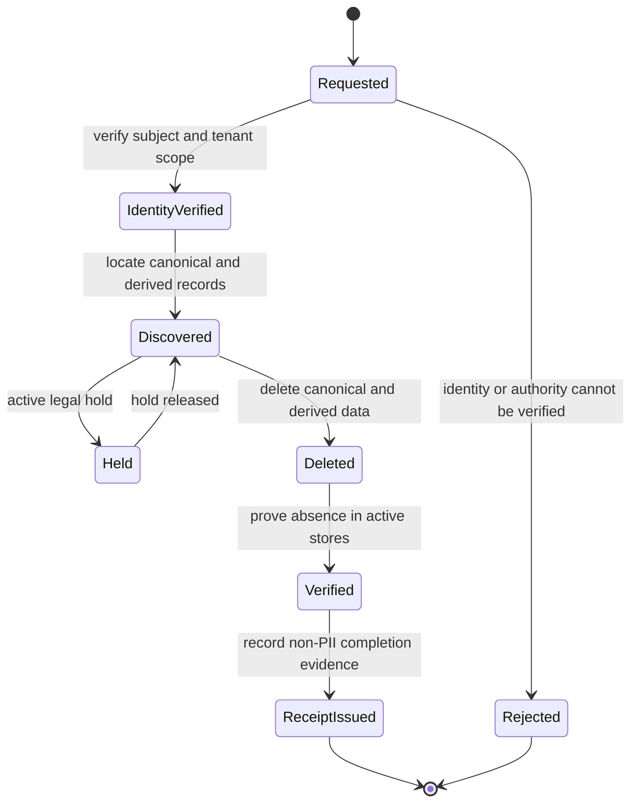

# Data Governance

## Scope and principles

This policy covers candidate input, job data, embeddings, match decisions, identity claims, and operational metadata. The platform minimizes candidate data, separates canonical records from derived representations, and defaults to no persistence when a use case does not require it.

Production deployments must bind every record and operation to a tenant. Legal and contractual requirements may shorten retention periods; extending them requires a recorded purpose, owner, and review date.

## Classification

| Class | Examples | Required handling |
|---|---|---|
| Public | Documentation, published job descriptions | Integrity controls and normal backups |
| Internal | Route template, status code, latency, correlation identifier | Tenant-safe access, bounded retention, no candidate content |
| Confidential | Tenant configuration, unpublished jobs, match evidence, actor identifiers | Authentication, RBAC, tenant isolation, encryption, audited access |
| Restricted | Candidate identity, contact data, free text, resume content, query embeddings, credentials | Explicit purpose, minimum access, encryption, redaction, deletion workflow; never written to logs |

Secrets, signing keys, and raw authentication tokens are Restricted but are managed by the secrets lifecycle, not the data-subject workflow.

## Processing and retention

| Data | Storage in v0.2 | Default retention | Disposal |
|---|---|---:|---|
| Candidate match request | Process memory only | Request lifetime | Released after the response; no body logging |
| Candidate query embedding | Process memory only | Request lifetime | Released after retrieval; never stored or logged |
| Candidate-derived source fingerprint | Immutable decision audit | 365 days | Retention worker deletes the complete audit record after hold checks |
| Match decision and evidence | Append-only audit table | 365 days | Privileged retention worker; no update API |
| Access event metadata | Security log sink | 90 days | Sink lifecycle policy |
| Job and tenant business data | PostgreSQL | Tenant contract lifetime plus 30 days | Verified tenant-scoped deletion and derived-vector cascade |
| Backup copies | Encrypted backup store | 35 days | Backup lifecycle expiration; deleted data is not restored into active service |

The candidate source fingerprint introduced by `TIP-103` must use a tenant-bound keyed digest so that predictable profile fields cannot be enumerated from a plain hash. Audit records contain no raw candidate fields.

## Access logging contract

Access events may contain timestamp, event type, correlation identifier, authenticated actor identifier, tenant identifier, HTTP method, route template, response status, duration, and authorization outcome.

Access events must not contain raw paths with user input, query strings, request or response bodies, candidate fields, resumes, contact data, tokens, prompts, embeddings, tool arguments, database statements, or exception payloads. Validation errors use allow-listed stable messages; custom validator text and rejected values are discarded at the HTTP boundary.

## Data-subject deletion workflow

1. Accept the request through an authenticated channel and assign a correlation identifier.
2. Verify the subject and tenant without copying identity documents into application logs.
3. Discover canonical records, derived vectors, caches, pending messages, and eligible audit records through tenant-scoped identifiers.
4. Check legal holds. Return a reason category and review date without exposing protected case details.
5. Delete canonical records in a transaction. Database cascades remove derived vectors; cache and asynchronous stores require idempotent invalidation.
6. Verify that active stores no longer return the subject. Backups expire through their lifecycle and cannot repopulate active data.
7. Retain a completion receipt containing request identifier, tenant, result category, timestamps, and executor, but no candidate content.

The target completion time is 30 calendar days. Retries are idempotent. A partial deletion remains open and emits an operational alert instead of being reported as complete.

## Current implementation evidence

- Candidate requests and query embeddings are transient and are not represented in the PostgreSQL schema.
- Stable validation messages discard rejected values and custom validator text; automated tests use synthetic data.
- Real in-memory RSA tokens cover invalid signatures, expiry, wrong roles, and cross-tenant HTTP access without external identities.
- Job embeddings are derived rows protected by a foreign-key cascade.
- Identity, tenant enforcement, keyed candidate fingerprints, and immutable decision storage are implemented by `TIP-101` through `TIP-104`.
- Runtime retention automation remains a production control to implement before persisted candidate profiles or automated decisions are introduced.

## Verification checklist

- Use synthetic identities in tests and fixtures.
- Prove missing, invalid, expired, wrong-role, and cross-tenant requests fail closed.
- Assert logs and error responses exclude seeded email, phone, free-text, token, and resume markers.
- Prove deletion removes canonical records, derived vectors, and cache entries while preserving a non-PII receipt.
- Exercise legal hold, repeated request, partial failure, and backup-restoration paths before production.
