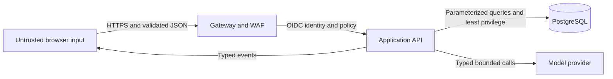

# Security Model

## Protected assets

- Candidate identity and profile data.
- Job catalog integrity and tenant ownership.
- Match decisions, evidence, and audit history.
- Model credentials, signing keys, and database credentials.
- Availability of interactive matching and ingestion workflows.

## Trust boundaries

OIDC is implemented locally for v0.2 development. The gateway, WAF, production identity deployment, and remote model boundary remain production targets.

## Current controls

- Bean Validation on HTTP payloads and bounded result limits.
- Parameterized JDBC statements.
- No external model credentials or resume ingestion.
- Security response headers at the web edge.
- Non-root API and web containers with read-only filesystems.
- A bounded executable tmpfs is dedicated to ONNX native libraries while the general temporary filesystem remains non-executable.
- Database credentials supplied through environment variables and excluded from Git.
- Stable API errors that avoid stack-trace disclosure.
- Validation errors discard rejected values and untrusted validator messages.
- OIDC Authorization Code with PKCE for the browser and signed JWT validation at the API.
- Exact issuer and audience validation with short-lived tokens and a required actor subject.
- Allow-listed recruiter/admin capabilities with fail-closed route authorization.
- Signed tenant identity propagated explicitly through use cases, SQL predicates, and composite database constraints.
- Local model output limited to embeddings; it cannot invoke tools or produce executable UI.

Candidate processing, retention, access-event fields, and deletion requirements are defined in the [data governance policy](data-governance.md).

## Required controls before production

- Managed secrets with rotation; no production secrets in environment files or manifests.
- TLS at every external boundary and encryption at rest with managed keys.
- Immutable decision audit with actor, purpose, source, policy, model, prompt, and embedding versions.
- Automated tenant-bound deletion and retention execution for persisted candidate data if profile storage is introduced.
- Rate limits, body-size limits, WAF rules, abuse detection, and safe CORS policy.
- SAST, SCA, secret scanning, DAST, SBOM, signed images, and deployment admission policy.

## Agent and Generative UI policy

- Tools are capability-specific and call application services, never infrastructure clients.
- Tool arguments and results use versioned schemas and are validated before execution.
- State changes require authorization, idempotency, audit, and the configured human approval gate.
- The model cannot create arbitrary component names or properties.
- React maps typed events to an allow-list and treats all textual content as untrusted.
- Tool budgets, recursion limits, timeouts, and cancellation are mandatory.

## Reporting

Report vulnerabilities privately using the process in the repository [security policy](../../SECURITY.md). Do not include real personal data, credentials, or exploitable production details in a public issue.
