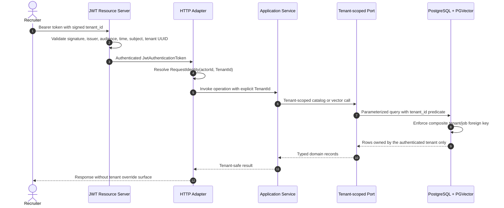

# Tenant Isolation

## Identity contract

The signed access token is the only tenant source of truth. The API requires a UUID-valued `tenant_id` claim plus a stable `sub` actor claim. It does not accept an `X-Tenant-Id` header, query parameter, request-body field, or browser-selected tenant identifier.

Missing or malformed tenant identity invalidates authentication. A valid actor without the required capability receives a deterministic authorization failure before business logic executes.

## Enforcement path

## Persistence invariants

- `tenants.id` is the ownership root.
- `jobs` stores a non-null `tenant_id` and exposes unique `(tenant_id, id)` ownership.
- `job_embeddings` stores the same non-null tenant and references `(tenant_id, job_id)` as a composite foreign key.
- Catalog reads, writes, counts, and vector searches always bind tenant identity.
- Vector search filters by both tenant and embedding model.
- Local migration assigns pre-v0.2 records to the versioned synthetic demo tenant; it does not delete catalog data.

The current control uses explicit application scoping plus database constraints. PostgreSQL row-level security is intentionally deferred until production database roles and pooled-connection context are defined; it must not be claimed as implemented.

## Cache and telemetry contract

Redis is not present in v0.2. When introduced, semantic-cache keys must be derived from `tenantId`, embedding model/version, normalized request fingerprint, and policy version. Entries require bounded TTLs, tenant-scoped invalidation, and stampede protection. No fallback may read a global or tenant-agnostic key.

Internal telemetry may record the tenant identifier, route template, status, latency, and correlation identifier. It must not record bearer tokens, raw claims, candidate payloads, embedding content, or match evidence.

## Verification

Automated tests use synthetic tenants to prove:

- tenant A cannot find or list tenant B jobs;
- tenant A vector search cannot return tenant B embeddings;
- a mismatched embedding tenant and canonical job is rejected by PostgreSQL;
- a missing or malformed `tenant_id` fails closed during JWT conversion;
- allowed HTTP requests receive tenant identity from the authenticated JWT.
